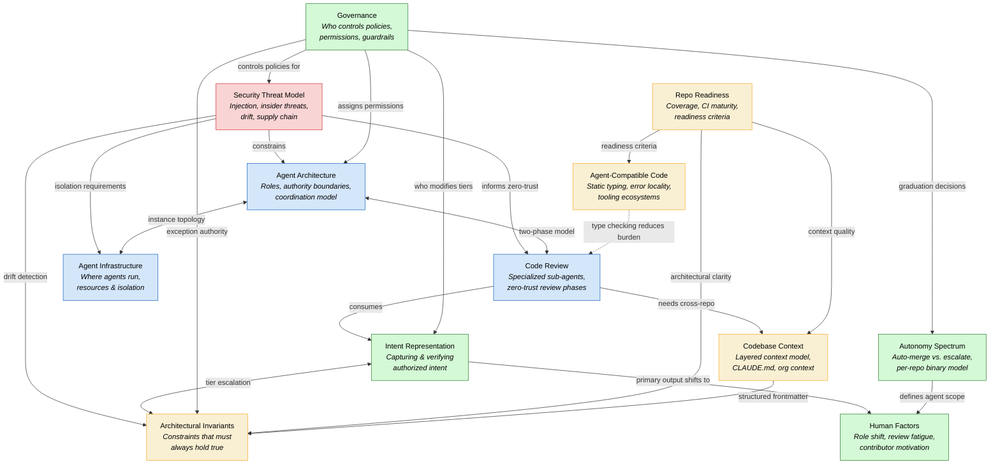

# Problem Domain Map

A visual map of how the problem domains in this project relate to each other.

## Diagram

## How to read this

The 12 problem domains cluster into four themes:

- **Security** (red) — The security threat model is foundational, informing zero-trust review, agent isolation, and drift detection
- **Agent System** (blue) — Architecture, infrastructure, and code review form the core agent machinery, tightly interconnected
- **Human & Policy** (green) — Governance, autonomy spectrum, intent representation, and human factors address who controls what and how humans interact with the system
- **Foundation** (yellow) — Repo readiness, codebase context, architectural invariants, and agent-compatible code are prerequisites that enable everything above

### Key structural observations

- **Security Threat Model** and **Governance** are the two most connected nodes — security constrains the technical design, governance constrains the policy design
- **Code Review** is the central integration point where security, architecture, intent, and context all converge
- **Architectural Invariants** bridges intent (what should be true) with readiness (what is true) and security (drift detection)
- The foundation layer flows upward — repos must be ready before agents can operate autonomously
