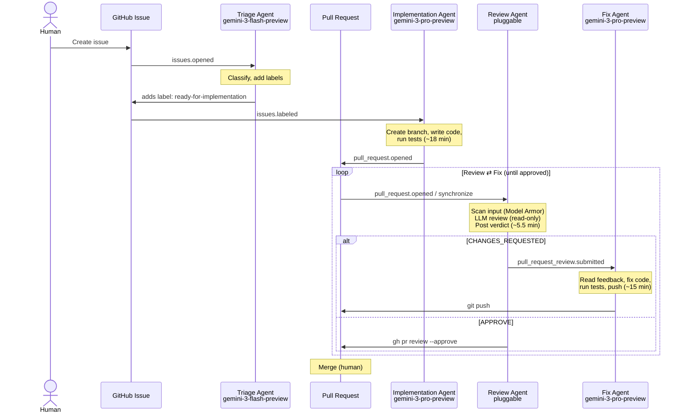
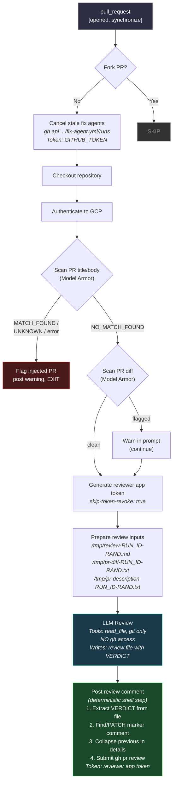
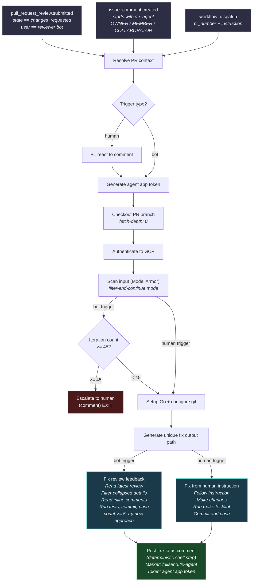
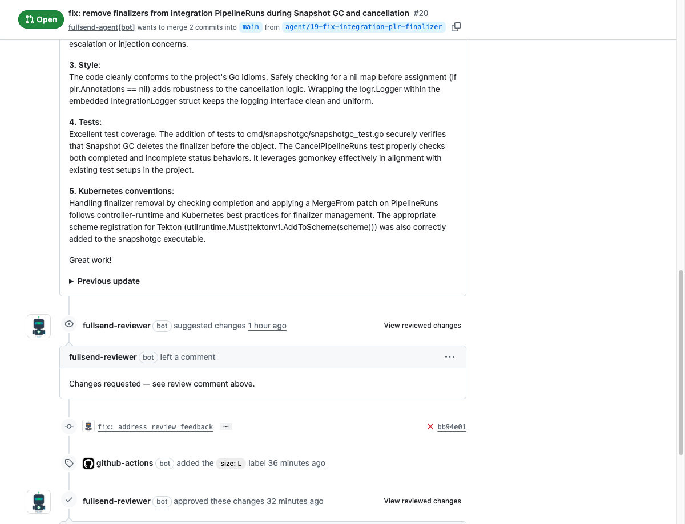

# Experiment: GitHub Actions Agent Runtime MVP

## Hypothesis

A fully autonomous SDLC pipeline — from issue triage to merge — can be implemented using only GitHub Actions workflows and AI agent CLIs, with the repository itself as the coordinator (no orchestrator agent). The review/fix loop should converge within a practical number of iterations.

## Background

Fullsend's core claim is that the repo is the coordinator. This experiment tests whether GitHub Actions' native event system (issue events, PR events, review events) can drive a multi-agent pipeline without a central orchestrator. Each agent runs in its own workflow, triggered by the previous agent's side effects.

The key question is whether the event-driven model provides enough coordination to handle the full lifecycle — including the review/fix loop where agents iterate autonomously until the reviewer approves.

**Test repo:** [nonflux/integration-service](https://github.com/nonflux/integration-service) (public playground fork)

## Setup

### Pipeline Architecture



### TL;DR — Pipeline in Action


*GIF preview — [view the full-quality video (webm)](fullsend-sdlc-demo.webm) for a clearer look.*

Every agent input passes through Google Cloud Model Armor scan before processing. Prompt injection detected → blocked + human notified.

### The Four Agents

| Agent | Trigger | Model | Tools | Token | Purpose |
|-------|---------|-------|-------|-------|---------|
| Triage | `issues.opened` | gemini-3-flash-preview | `gh`, `read_file` (restricted) | AGENT_TOKEN (PAT) | Classify issues, add labels, determine readiness |
| Implementation | `issues.labeled` (`ready-for-implementation`) | gemini-3-pro-preview | Unrestricted shell (git, gh, make, go) | AGENT_TOKEN (PAT) | Create branch, write code, run tests, open PR |
| Review | `pull_request.opened/synchronize` | Pluggable (see below) | `read_file`, `git` only — **no gh** | Reviewer App token (post step only) | Review code quality and security |
| Fix | `pull_request_review.submitted` | gemini-3-pro-preview | Unrestricted shell (git, gh, make, go) | Agent App token | Read feedback, fix code, push |

### Pluggable Reviewer Architecture

The review agent slot is designed to be filled by **any** code review tool that can post a GitHub `pull_request_review` with `APPROVE` or `CHANGES_REQUESTED`. The fix agent triggers on the review event regardless of which reviewer posted it.

| Reviewer | Type | Identity | Status |
|----------|------|----------|--------|
| Gemini CLI (built-in) | Gemini via `run-gemini-cli` action | `fullsend-reviewer[bot]` (GitHub App) | **Verified on [PR #7](https://github.com/nonflux/integration-service/pull/7)** |
| cicaddy-action | Reusable GitHub Action | `fullsend-reviewer[bot]` (GitHub App) | Verified on [PR #1](https://github.com/nonflux/integration-service/pull/1) |
| Qodo (formerly Codium) | Third-party SaaS | `qodo-merge-pro[bot]` | Planned |
| CodeRabbit | Third-party SaaS | `coderabbitai[bot]` | Planned |

For the fix agent to trigger from a reviewer, the fix-agent.yml `if:` condition must include the reviewer's bot login:

```yaml
github.event.review.user.login == 'fullsend-reviewer[bot]'
# To add more reviewers:
# || github.event.review.user.login == 'qodo-merge-pro[bot]'
# || github.event.review.user.login == 'coderabbitai[bot]'
```

Third-party reviewers (Qodo, CodeRabbit) don't need identity isolation setup — they already have their own bot identity. The main integration point is the fix agent's trigger filter.

### Identity Model

| Component | GitHub Identity | Token Source | Purpose |
|-----------|----------------|-------------|---------|
| Triage Agent | `fullsend-agent[bot]` or PAT | AGENT_TOKEN (PAT) | Label issues, post triage comment |
| Implementation Agent | PAT user identity | AGENT_TOKEN (PAT) | Push branches, open PRs (must trigger review agent) |
| Review Agent | `fullsend-reviewer[bot]` | GitHub App (REVIEWER_APP_ID) | Post reviews, trigger fix agent |
| Fix Agent | `fullsend-agent[bot]` | GitHub App (AGENT_APP_ID) | Push commits, post status |
| Cancel stale fixes | `github-actions[bot]` | GITHUB_TOKEN | Cancel workflows (no event trigger needed) |
| Injection scanner | Service account | GCP_SA_KEY (static key — see [015](issues/015-gcp-workload-identity-federation.md)) | Scan for prompt injection |

**Why PAT for Implementation Agent?** `GITHUB_TOKEN` events don't trigger other workflows. A PAT from a different identity breaks this restriction so the Implementation Agent's PR triggers the Review Agent.

**Why separate GitHub App for Reviewer?** GitHub prevents the same token from authoring AND approving PRs. A separate reviewer identity solves the self-approval problem.

### Review Agent Flow



### Fix Agent Flow



### Concurrency Model

```
Review Agent group: fullsend-review-pr-{N}
  cancel-in-progress: true
  → New push cancels stale review, latest review wins

Fix Agent group: fullsend-fix-pr-{N}
  cancel-in-progress: true
  → New fix cancels stale fix of same trigger type

Cross-workflow:
  Review Agent step 1 → Cancel stale fix agents via API
  (prevents stale fixes from pushing after new code lands)
```

### Security Layers

1. **Model Armor** — Scans PR body, diff, review comments, and issue content for prompt injection at every agent entry point
2. **Fail-closed scanning** — `UNKNOWN` or error from Model Armor → block (not pass)
3. **Token isolation (Review Agent)** — Review agent's LLM has no `gh` tool and no write-capable token; write actions only in deterministic post step
4. **Unique file paths** — `${RUN_ID}-$(openssl rand -hex 8)` prevents artifact hijack between steps
5. **CODEOWNERS** — Agent workflow files, scripts, agent config (`GEMINI.md`, `.gemini/`), and CODEOWNERS itself require `fullsend-sig` team approval
6. **Branch protection** — `require_code_owner_reviews: true` enforces CODEOWNERS approval on `main`; `dismiss_stale_reviews: true` invalidates prior approvals after new pushes
7. **Fork PR blocking** — Fix agent refuses to run on fork PRs
8. **Iteration cap** — Hard limit at 45 review-fix cycles, escalates to human
9. **Identity separation** — Reviewer and fixer are different GitHub Apps
10. **Least-privilege tools** — Each agent's tool allowlist is restricted to what it needs

### Branch Protection (Recommended Target Repo Config)

The test repo ([nonflux/integration-service](https://github.com/nonflux/integration-service)) uses these branch protection settings on `main`:

| Setting | Value | Why |
|---------|-------|-----|
| Require pull request reviews | Yes | Agents cannot push directly to `main` |
| Required approving review count | 1 | At least one approval before merge |
| Require code owner reviews | **Yes** | Enforces CODEOWNERS rules — agent workflow/config changes need team approval |
| Dismiss stale reviews | **Yes** | New push (e.g., fix agent commit) invalidates prior approval, forcing re-review |
| Require last push approval | No | Not needed — the review agent re-reviews on every `synchronize` event |

**CODEOWNERS** protects agent infrastructure from self-modification:

```
# Agent workflows — listed individually, not as a glob
/.github/workflows/triage-agent.yml          @nonflux/fullsend-sig
/.github/workflows/implementation-agent.yml  @nonflux/fullsend-sig
/.github/workflows/review-agent.yml          @nonflux/fullsend-sig
/.github/workflows/fix-agent.yml             @nonflux/fullsend-sig

# Agent config and scripts
/GEMINI.md                                   @nonflux/fullsend-sig
/.gemini/                                    @nonflux/fullsend-sig
/.github/scripts/                            @nonflux/fullsend-sig

# CODEOWNERS itself — prevents agents from weakening review gates
/.github/CODEOWNERS                          @nonflux/fullsend-sig
```

The combination of CODEOWNERS + `require_code_owner_reviews` means agents can push workflow changes during the review/fix loop, but those changes cannot be merged without human team approval.

### In-Place Comment Updates

The review and fix agents each use a single PR comment with an HTML marker (`<!-- fullsend:review-agent -->` / `<!-- fullsend:fix-agent -->`), editing it in-place on each new cycle. Previous content is collapsed into a `<details>` block. GitHub tracks the edit history, keeping the PR timeline clean.

### Context Passing Between Steps

```mermaid
flowchart TD
    subgraph EventPayload["GitHub Event Payload"]
        EP1["PR number, branch ref, author"]
        EP2["Review body (for fix agent)"]
        EP3["Comment body (for /fix-agent command)"]
    end

    subgraph StepOutputs["Step Outputs ($GITHUB_OUTPUT)"]
        SO1["steps.pr.outputs.{number, ref, trigger, instruction}"]
        SO2["steps.scan.outputs.{detected}"]
        SO3["steps.diff-scan.outputs.{flagged}"]
        SO4["steps.iteration.outputs.{count, escalate, reason}"]
        SO5["steps.review-path.outputs.{file, diff, desc}"]
        SO6["steps.fix-path.outputs.{file}"]
        SO7["steps.app-token.outputs.{token}"]
    end

    subgraph TempFiles["Temp Files (unique per run, anti-hijack)"]
        TF1["/tmp/review-{RUN_ID}-{RAND}.md"]
        TF2["/tmp/pr-diff-{RUN_ID}-{RAND}.txt"]
        TF3["/tmp/pr-description-{RUN_ID}-{RAND}.txt"]
        TF4["/tmp/fix-status-{RUN_ID}-{RAND}.md"]
    end

    subgraph CrossWorkflow["Cross-Workflow (review → fix)"]
        CW1["pull_request_review event (primary)"]
        CW2["workflow_dispatch API call (fallback)"]
        CW3["PR comments with markers (persistent state)"]
    end

    EventPayload --> StepOutputs --> TempFiles --> CrossWorkflow

    style EventPayload fill:#2d2d44,stroke:#888,color:#fff
    style StepOutputs fill:#2d2d44,stroke:#888,color:#fff
    style TempFiles fill:#2d2d44,stroke:#888,color:#fff
    style CrossWorkflow fill:#2d2d44,stroke:#888,color:#fff
```



## Running

### Demo 1: First-Pass Approval — [Issue #15](https://github.com/nonflux/integration-service/issues/15) → [PR #16](https://github.com/nonflux/integration-service/pull/16)

Created [Issue #15](https://github.com/nonflux/integration-service/issues/15) (gosec G708 warnings fix). The pipeline processed it end-to-end:

1. **Triage agent** (~1 min) — classified as `bug`, added labels including `ready-for-implementation`
2. **Implementation agent** (~18 min) — created branch, wrote fix, opened [PR #16](https://github.com/nonflux/integration-service/pull/16)
3. **Review agent** (~5 min) — **APPROVED** on first pass

Total: ~24 min, zero human intervention.

### Demo 2: Review/Fix Loop — [Issue #19](https://github.com/nonflux/integration-service/issues/19) → [PR #20](https://github.com/nonflux/integration-service/pull/20)

Created [Issue #19](https://github.com/nonflux/integration-service/issues/19) (finalizer removal bug). This time the review agent found issues:

| Stage | Agent | Duration | Result |
|-------|-------|----------|--------|
| Triage | Triage Agent | ~1 min | Labels: `bug`, `kind/bug`, `area/controller`, `area/gitops`, `priority/high`, `ready-for-implementation` |
| Implementation | Implementation Agent | ~18 min | Created [PR #20](https://github.com/nonflux/integration-service/pull/20) |
| Review (1st) | Review Agent | ~7 min | **CHANGES_REQUESTED** |
| Fix | Fix Agent | ~30 min | Commit `bb94e01` — `fix: address review feedback` |
| Review (2nd) | Review Agent | ~4 min | **APPROVED** — "LGTM" |

Total: ~60 min, zero human intervention. The review/fix loop converged in one iteration.

**[Full demo video (58s, webm)](fullsend-sdlc-demo.webm)** — end-to-end pipeline from issue creation to approval.

#### Review/Fix Loop in PR Timeline



The PR timeline shows the full autonomous loop: review agent requested changes → fix agent committed `fix: address review feedback` → review agent approved on re-review.

### Review/Fix Loop — Verified on [PR #7](https://github.com/nonflux/integration-service/pull/7)

[PR #7](https://github.com/nonflux/integration-service/pull/7) verified the review/fix loop end-to-end with 3 successful bot commits during development of the pipeline itself. This was the primary validation PR where the concurrency model, identity isolation, and comment update patterns were iterated on.

## Results

### What Works

| Feature | Status | Notes |
|---------|--------|-------|
| Full review→fix→push loop | **Working** | 3 successful bot commits on [PR #7](https://github.com/nonflux/integration-service/pull/7) |
| Full issue→triage→implement→review→merge pipeline | **Working** | [Issue #15](https://github.com/nonflux/integration-service/issues/15) → [PR #16](https://github.com/nonflux/integration-service/pull/16) (first-pass), [Issue #19](https://github.com/nonflux/integration-service/issues/19) → [PR #20](https://github.com/nonflux/integration-service/pull/20) (with fix loop) |
| In-place comment updates | **Working** | Single comment per agent, collapsed history |
| Deterministic comment posting | **Working** | Shell step, not LLM — eliminates duplicates |
| Separate bot identities | **Working** | `fullsend-reviewer[bot]` reviews, `fullsend-agent[bot]` pushes |
| Fix agent triggering from review | **Working** | `pull_request_review` event from app token |
| `/fix-agent` human command | **Partial** | Trigger verified (workflow started, +1 reaction posted), but cancelled by incoming commit before full run completed |
| `workflow_dispatch` fallback | **Working** | For when events are throttled |
| Model Armor integration | **Working** | Hard block on PR body, filter-and-continue on diff/comments |
| Iteration cap (45) | **Working** | Escalates to human with CODEOWNERS mention |
| Strategy escalation (>=5 cycles) | **Working** | Prompt tells agent to try new approach |
| Cancel stale fix agents | **Working** | Review agent cancels in-progress fixes on new push |
| Unique artifact file paths | **Working** | Run ID + random hex prevents hijack |
| Token isolation | **Working** | LLM gets read-only token, write-only in post step |
| Pluggable reviewer slot | **Working** | Any tool that posts a GitHub review can fill the slot |

### Timing Data (from [PR #7](https://github.com/nonflux/integration-service/pull/7))

#### Review Agent (11 successful runs)

| Run | Duration | Notes |
|-----|----------|-------|
| 23645733079 | ~5 min | Early, smaller diff |
| 23646406199 | ~3.5 min | |
| 23646546863 | ~4.5 min | |
| 23646792809 | ~5 min | |
| 23648438805 | ~6.5 min | |
| 23649109721 | ~4.5 min | |
| 23649767441 | ~5 min | |
| 23650887715 | ~10 min | Larger diff after workflow changes |
| 23652775666 | ~8.5 min | |
| 23654379038 | ~4.5 min | |
| 23657972959 | ~5 min | |
| **Mean** | **~5.5 min** | |

#### Fix Agent (3 successful runs)

| Run | Duration | Notes |
|-----|----------|-------|
| 23608344342 | ~7 min | Small fix |
| 23627557889 | ~21 min | Larger fix |
| 23644666720 | ~17 min | After workflow refactoring |
| **Mean** | **~15 min** | Range: 7-21 min |

#### Full Loop Cycle (review + fix + push)

- **Best case**: ~12 min (fast review + small fix)
- **Typical**: ~20-25 min
- **Worst case**: ~35 min (long review + complex fix)

### Fix Agent Telemetry (from gemini-output artifacts)

| Metric | Run 23644666720 (~17 min) | Run 23627557889 (~21 min) |
|--------|--------------------------|--------------------------|
| **LLM API time** (gemini-3.1-pro) | 283.9s (~4.7 min, 29%) | 341.8s (~5.7 min, 29%) |
| **Tool execution time** (shell) | 689.5s (~11.5 min, 71%) | 832.9s (~13.9 min, 70%) |
| **Loop detector** (gemini-3-flash) | 4.3s (<1%) | 12.2s (1%) |
| API requests | 44 (0 errors) | 62 (0 errors) |
| Tool calls | 48 (47 shell, 1 read_file) | 61 (60 shell, 1 read_file) |
| Total tokens | 1.49M (89% cached) | 2.38M (91% cached) |

**Key findings:**
- **~70% of fix agent time is shell command execution** (make test, make lint, git, gh api), not LLM inference
- LLM thinking is only ~30% of total time (~5-6 min per run)
- Token caching is highly effective (89-91% hit rate) — Gemini caches prior context across multi-turn
- The `read_file` tool is barely used (1 call per run) — agent prefers `run_shell_command` for reading files
- The loop detector (flash model) adds negligible overhead
- **Optimization target is tool execution**, not model speed — faster test/lint or parallelized commands would have the most impact

### What Failed and Was Reverted

| Approach | Why It Failed |
|----------|---------------|
| Shared concurrency group for review+fix | Review and fix cancel each other. Max queue depth 1. |
| `cancel-in-progress` per workflow in shared group | GitHub evaluates incoming workflow's setting, not existing. Asymmetric behavior. |
| LLM posts comments via prompt instructions | LLM unreliably follows complex shell sequences. Creates duplicates. |
| `gh auth login` in post step with `GH_TOKEN` env | Conflicts — `gh` complains when both are set. `GH_TOKEN` env var is sufficient. |
| `GITHUB_TOKEN` passed to LLM for read-only | `GITHUB_TOKEN` has `pull-requests: write` from workflow permissions. Agent can still post as wrong bot. |
| `workflows: write` in YAML permissions block | Causes parse error with `workflow_dispatch` trigger. App token handles this at the GitHub App settings level. |
| Trusted scripts from base branch checkout | Scripts don't exist on base branch (main) yet — only on PR branch. Breaks the workflow. |
| Review content in `gh pr review --body` | Creates visible review with full content + separate issue comment = duplicate noise. |

## Known Issues

| # | Issue | Status |
|---|-------|--------|
| [001](issues/001-fix-agent-performance.md) | Fix agent cycle time slow (7-21 min per iteration) — 70% is shell execution | Open |
| [002](issues/002-workflow-push-permission.md) | Fix agent workflow push permission vs guardrails | **Resolved** |
| [003](issues/003-github-event-throttling.md) | GitHub throttles `pull_request_review` events after ~20 from same bot on one PR | Open |
| [004](issues/004-concurrent-fixes-and-rebase.md) | Concurrent bot + human fixes share concurrency group, causing cancellation | Open |
| [005](issues/005-review-verdict-entries-accumulate.md) | Review verdict entries (`--request-changes`) accumulate in PR timeline | Open |
| [006](issues/006-scan-missing-detail.md) | Prompt injection scan returns match state only, not flagged snippet | Open |
| [007](issues/007-reusable-workflows.md) | Workflows hardcoded per repo — need reusable workflows for multi-repo | Open |
| [009](issues/009-triage-no-retry.md) | Triage agent only triggers on `issues.opened` — no retry on failure | Open |
| [010](issues/010-fix-agent-workflow-mutation.md) | Fix agent modifying workflow files can break agent pipelines | Open |
| [011](issues/011-gemini-cli-output-parsing.md) | `run-gemini-cli` output parsing failure with special characters (upstream) | Open |
| [012](issues/012-diff-scan-truncation-bypass.md) | Prompt injection scan truncates diff at 1000 lines — bypass possible | Open |
| [013](issues/013-github-output-multiline-injection.md) | `GITHUB_OUTPUT` multi-line value injection via `echo "instruction=$X"` | Open |
| [014](issues/014-triage-multi-label-race.md) | Triage agent multi-label race causes implementation agent concurrency cancellation | Open |
| [015](issues/015-gcp-workload-identity-federation.md) | GCP auth uses static SA key — replace with Workload Identity Federation | Open |
| [016](issues/016-gemini-metrics-export.md) | Agent telemetry trapped in artifacts — export to GCP Cloud Monitoring | Open |

## Security Notes

- All agent inputs are scanned by Google Cloud Model Armor for prompt injection before processing
- Scanner operates in fail-closed mode (unknown results → block)
- The review agent's LLM never has write access to GitHub — all mutations happen in deterministic shell steps
- Each workflow uses unique temp file paths (`${RUN_ID}-$(openssl rand -hex 8)`) to prevent artifact hijack between steps
- The fix agent has an iteration cap (45 cycles) to prevent infinite loops
- Fork PRs are blocked from triggering the fix agent
- Identity separation: reviewer and fixer are different GitHub Apps — prevents self-approval
- See `experiments/model-armor-vs-claude-triage/` for prompt injection scanner effectiveness testing
- See `experiments/prompt-injection-defense/` for AI agent inherent injection resistance testing
